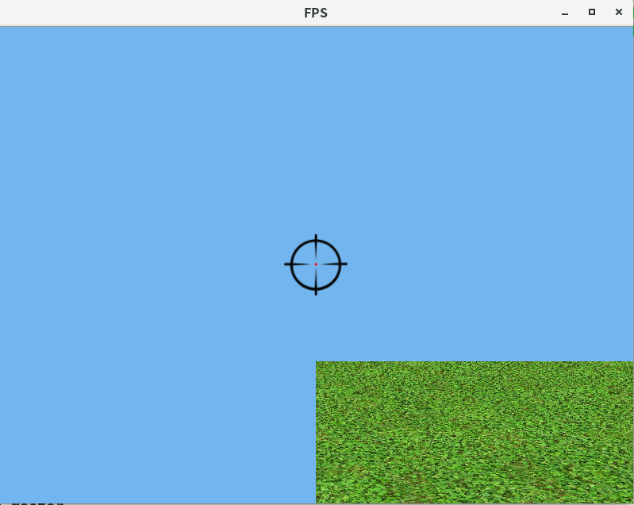

# shooter
A simple FPS game written with C++ and OpenGL.

## Run
A binary excutable file is provided, and it may run on your Linux if you have compatible OpenGL and GLFW3.  
`$ ./shooter`  
Then you may see the scene in the following picture:  
  
You can press the arrow keys and move your mouse around.  
Press `ESC` to quit.
## Compile
`$ make`
## Dependencies
### glfw3
### glm
### glad (Optional)
This lib is optional, as it's contained in this repo, but you can modify it to your prefer.  
OpenGL 4.0 core  
can be found in https://glad.dav1d.de/  
Setting up method:  
https://learnopengl.com/Getting-started/Creating-a-window  
## Reference
- https://learnopengl.com/Getting-started/Camera
- https://learnopengl.com/In-Practice/2D-Game/Breakout
